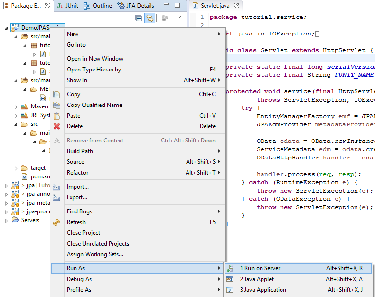
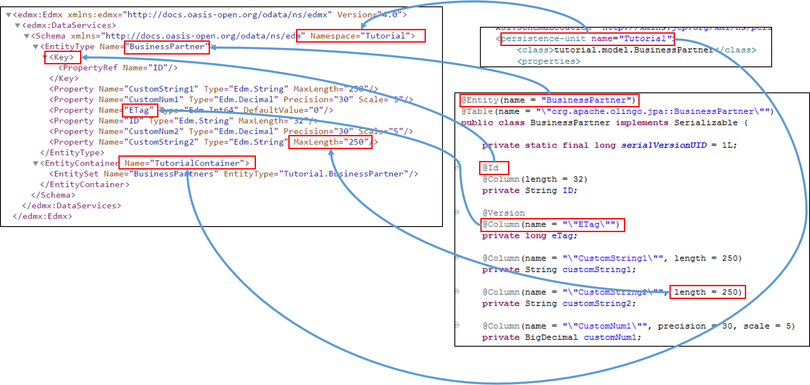

# 1.1: Create A Simple Entity
We want to start with a very simple Business Partner entity. As the first step we create a package in our _src/main/java_ folder: _tutorial.model_. Within that package we create class BusinessPartner, which implements the Serializable interface:
```Java
package tutorial.model;

import java.io.Serializable;
import java.math.BigDecimal;
import javax.persistence.Column;
import javax.persistence.Entity;
import javax.persistence.Id;
import javax.persistence.Table;
import javax.persistence.Version;

/**
 * Entity implementation class for Entity: BusinessPartner
 *
 */
@Entity(name = "BusinessPartner")
@Table(schema = "\"OLINGO\"", name = "\"BusinessPartner\"")
public class BusinessPartner{

	@Id
	@Column(length = 32)
	private String iD;

	@Version
	@Column(name = "\"ETag\"")
	private long eTag;

	@Column(name = "\"CustomString1\"", length = 250)
	private String customString1;

	@Column(name = "\"CustomString2\"", length = 250)
	private String customString2;

	@Column(name = "\"CustomNum1\"", precision = 30, scale = 5)
	private BigDecimal customNum1;

	@Column(name = "\"CustomNum2\"", precision = 30, scale = 5)
	private BigDecimal customNum2;

	public BusinessPartner() {
		super();
	}
}
```
Next we have to create our _persistence.xml_ file. This will be located under _src/main/resources_ in a new folder called _META-INF_.
```XML
<?xml version="1.0" encoding="UTF-8"?>
<persistence version="2.1"
	xmlns="http://xmlns.jcp.org/xml/ns/persistence" xmlns:xsi="http://www.w3.org/2001/XMLSchema-instance"
		xsi:schemaLocation="http://xmlns.jcp.org/xml/ns/persistencehttp://xmlns.jcp.org/xml/ns/persistence/persistence_2_1.xsd">
	<persistence-unit name="Tutorial">
		<class>tutorial.model.BusinessPartner</class>
		<properties>
			<property name="eclipselink.logging.level.sql" value="FINEST" />
			<property name="eclipselink.logging.parameters" value="true" />
			<property name="eclipselink.logging.timestamp" value="true" />
			<property name="eclipselink.weaving" value="static" />
			<property name="eclipselink.persistence-context.flush-mode" value="commit" />
			<property name="javax.persistence.validation.mode" value="NONE" />
			<property name="javax.persistence.jdbc.url" value="jdbc:hsqldb:mem:com.sample" />
			<property name="javax.persistence.jdbc.driver" value="org.hsqldb.jdbcDriver" />
		</properties>
	</persistence-unit>
</persistence>
```
The XML file is as of now dominated by information about the logging and the data base connection. Therefore I like to point to two lines. First the name of the persistence-unit, here _Tutorial_. This is important for us for two reasons:
  1. It is the link between the metadata and the entity manager
  2. It is used as the OData namespace

Only one persistence unit is supported, which means also only one OData schema within a Data Services Document is supported. The other one is the declaration of the JPA entity class _<class>tutorial.model.BusinessPartner</class>_. Over the time we will add more here.


Now its time to create our web service. First we want to maintain the _web.xml_ file. This should be located in _/src/main/webapp/WEB-INF_. The service shall be accessible under the path _/Tutorial.svc/_:
```XML
<web-app xmlns:xsi="http://www.w3.org/2001/XMLSchema-instance"
	xmlns="http://java.sun.com/xml/ns/javaee" xmlns:web="http://java.sun.com/xml/ns/javaee"
	xsi:schemaLocation="http://java.sun.com/xml/ns/javaee http://java.sun.com/xml/ns/javaee/web-app_2_5.xsd"
	id="WebApp_ID" version="2.5">
	<servlet>
		<servlet-name>Tutorial</servlet-name>
		<servlet-class>tutorial.service.Servlet</servlet-class>
		<load-on-startup>1</load-on-startup>
	</servlet>
		<servlet-mapping>
		<servlet-name>Tutorial</servlet-name>
		<url-pattern>/Tutorial.svc/*</url-pattern>
	</servlet-mapping>
</web-app>
```
Second we create the servlet. For this we create a new package _tutorial.service_ in _/src/main/java_.The class shall have the name _Servlet_, as we have declared it in the _web.xml_ file and inherit from _javax.servlet.http.HttpServlet_. We overwrite the method _service_.
```Java
package tutorial.service;

import java.io.IOException;
import java.util.ArrayList;

import javax.persistence.EntityManagerFactory;
import javax.servlet.ServletException;
import javax.servlet.http.HttpServlet;
import javax.servlet.http.HttpServletRequest;
import javax.servlet.http.HttpServletResponse;

import org.apache.olingo.commons.api.ex.ODataException;
import com.sap.olingo.jpa.metadata.api.JPAEdmProvider;
import com.sap.olingo.jpa.metadata.api.JPAEntityManagerFactory;
import org.apache.olingo.server.api.OData;
import org.apache.olingo.server.api.ODataHttpHandler;
import org.apache.olingo.server.api.ServiceMetadata;
import org.apache.olingo.server.api.edmx.EdmxReference;

public class Servlet extends HttpServlet {

	private static final long serialVersionUID = 1L;
	private static final String PUNIT_NAME = "Tutorial";

	@Override
	protected void service(HttpServletRequest req, HttpServletResponse resp) throws ServletException, IOException {
		try {

			EntityManagerFactory emf = JPAEntityManagerFactory.getEntityManagerFactory(PUNIT_NAME, new HashMap<String, Object>());
			JPAEdmProvider metadataProvider = new JPAEdmProvider(PUNIT_NAME, emf, null);

			OData odata = OData.newInstance();
			ServiceMetadata edm = odata.createServiceMetadata(metadataProvider, new ArrayList<EdmxReference>());
			ODataHttpHandler handler = odata.createHandler(edm);

			handler.process(req, resp);
		} catch (RuntimeException e) {
			throw new ServletException(e);
		} catch (ODataException e) {
		throw new ServletException(e);
		}
	}
}
```
Let's have a look at the code. We have created a constants _PUNIT_NAME_ to store the name of our persistence unit. This is used on the hand to create a the Entity Manger Factory. JPA Processor provides a factory for this, which is used here, but it is not mandatory to use it. On the other hand JPAEdmProvider is created. This class is responsible for converting the JPA metadata into OData metadata. The other calls are needed to let Olingo answer the request.
Now we can have a look at what we have achieved up to now. For this we want to run our app on a server. To do make a right mouse click on the project and choose _Run As -> Run on Server_ .



Choose a web server and start it. With the following url you should now get the service document _http://localhost:8080/Tutorial/Tutorial.svc/_, which should look as follows:
```XML
<app:service xmlns:atom="http://www.w3.org/2005/Atom" xmlns:app="http://www.w3.org/2007/app" xmlns:metadata="http://docs.oasis-open.org/odata/ns/metadata" metadata:context="$metadata">
	<app:workspace>
		<atom:title>Tutorial.TutorialContainer</atom:title>
		<app:collection href="BusinessPartners" metadata:name="BusinessPartners">
			<atom:title>BusinessPartners</atom:title>
		</app:collection>
	</app:workspace>
</app:service>
```
With _http://localhost:8080/Tutorial/Tutorial.svc/$metadata_ we can have a look at our metadata document. The following picture should give an overview of the metadata mapping:



As already mentioned the persistence unit has become the namespace of our OData schema. In addition it is used to name the container. The JPA Entity name became the OData Entity Type name and its plural is used as the name of the Entity Type Set. Column metadata is converted in to Property metadata, like name, length or precision and scale.

Please go ahead with [Tutorial 1.2 : Use Navigation Properties](1-2-UseNavigationProperties.md)
