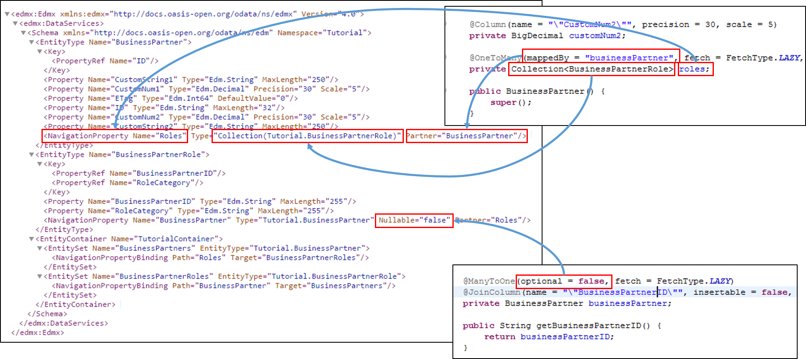

# 1.2: Use Navigation Properties
We want to be able to distinguish between different types of Business Partner e.g. a Customer or Supplier or want to know if a Business Partner is both. To do so we introduce a new entity the Business Partner Role. As mentioned it is required that we can assign multiple Roles to a Business Partner, which can be distinguished by the Category. To do so we created a key out of multiple attributes. JPA requires here an Id class:
```Java
package tutorial.model;

import java.io.Serializable;
import javax.persistence.Id;

public class BusinessPartnerRoleKey implements Serializable {

    private static final long serialVersionUID = 1L;
	
    @Id
    @Column(name = "\"BusinessPartnerID\"")
    private String businessPartnerID;
    @Id
    @Column(name = "\"BusinessPartnerRole\"")
    private String roleCategory;

    @Override
    public boolean equals(Object obj) {
	    if (this == obj)
		    return true;
	    if (obj == null)
		    return false;
	    if (getClass() != obj.getClass())
		    return false;
	    BusinessPartnerRoleKey other = (BusinessPartnerRoleKey) obj;
	    if (businessPartnerID == null) {
		    if (other.businessPartnerID != null)
			    return false;
	    } else if (!businessPartnerID.equals(other.businessPartnerID))
		    return false;
	    if (roleCategory == null) {
		    if (other.roleCategory != null)
		    	    return false;
	    } else if (!roleCategory.equals(other.roleCategory))
	    	    return false;
	    return true;
    }

    @Override
    public int hashCode() {
	    final int prime = 31;
	    int result = 1;
	    result = prime * result + ((businessPartnerID == null) ? 0 : businessPartnerID.hashCode());
	    result = prime * result + ((roleCategory == null) ? 0 : roleCategory.hashCode());
	    return result;
    }
}
```
Now we can create class BusinessPartnerRole, which has not more than the key values:
```Java
package tutorial.model;

import javax.persistence.Column;
import javax.persistence.Entity;
import javax.persistence.FetchType;
import javax.persistence.Id;
import javax.persistence.IdClass;
import javax.persistence.JoinColumn;
import javax.persistence.ManyToOne;
import javax.persistence.Table;

import org.eclipse.persistence.annotations.ReadOnly;

@IdClass(BusinessPartnerRoleKey.class)
@ReadOnly
@Entity(name = "BusinessPartnerRole")
@Table(schema = "\"OLINGO\"", name = "\"BusinessPartnerRole\"")
public class BusinessPartnerRole {
  @Id
  @Column(name = "\"BusinessPartnerID\"")
  private String businessPartnerID;
  
  @Id
  @Column(name = "\"BusinessPartnerRole\"")
  private String roleCategory;

  @ManyToOne(optional = false, fetch = FetchType.LAZY)
  @JoinColumn(name = "\"BusinessPartnerID\"", insertable = false, updatable = false)
  private BusinessPartner businessPartner;

  public String getBusinessPartnerID() {
    return businessPartnerID;
  }

  public String getRoleCategory() {
        return roleCategory;
  }

  public BusinessPartner getBusinessPartner() {
     return businessPartner;
  }
}
```
The only thing in addition is a JPA Association _private BusinessPartner businessPartner_, which enables us to navigate from a Role to the corresponding Business Partner. 
To be able to do the same in the other direction, so navigate from a Business Partner to its Roles, we need to add a corresponding association also at the Business Partner 
(note that we linked both using _mappedBy_):
```Java
public class BusinessPartner implements Serializable {
	...
	@Column(name = "\"CustomNum2\"", precision = 30, scale = 5)
	private BigDecimal customNum2;

	@OneToMany(mappedBy = "businessPartner", fetch = FetchType.LAZY, cascade = CascadeType.REMOVE)
	private Collection<BusinessPartnerRole> roles;

	public BusinessPartner() {
		super();
	}
    ...
```
Last but not least we have to declare the new entity within the persistence.xml:  
```XML
	<?xml version="1.0" encoding="UTF-8"?>  
	...  
	\<persistence-unit name="Tutorial"\>  
		\<class\>tutorial.model.BusinessPartner\</class\>  
		\<class\>tutorial.model.BusinessPartnerRole\</class\>  
		\<properties\>  
	...  
```

If we call _http://localhost:8080/Tutorial/Tutorial.svc/$metadata_ we can see that the metadata document now shows the second entity as well as the introduced navigation. The following picture should give an overview of the metadata mapping:    

  

Please go ahead with [Tutorial 1.3: Text Associations](1-3-TextAssociations.md)    
